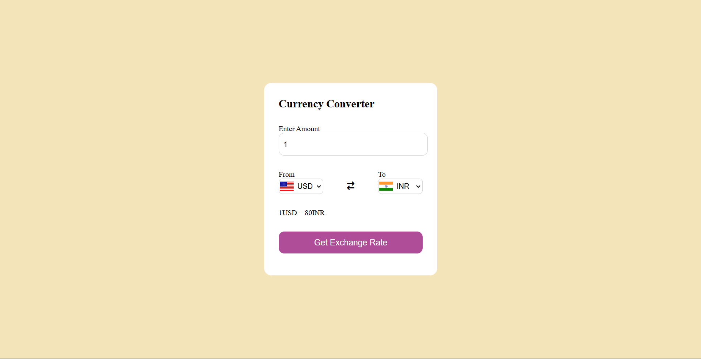

# Currency Converter

A web application to convert currencies between different countries using real-time exchange rates.

[Live Demo](https://currencyconverter-html-css-javascript.netlify.app/)

---

## Overview
This project demonstrates:
- Conversion of currencies between multiple countries.
- Real-time exchange rate calculations.
- A user-friendly interface for quick conversions.

---

## Features
- **Multiple Currencies Support:** Convert between a wide range of currencies.
- **Real-Time Exchange Rates:** Fetches up-to-date exchange rates.
- **Responsive Design:** Works seamlessly on all devices.
- **User-Friendly Interface:** Simple layout for quick and easy conversions.

---

## Technologies Used

### Frontend
- **HTML5:** Structured content.
- **CSS3:** Styling and responsive design.
- **JavaScript:** Dynamic functionality and API integration.

### Hosting
- Hosted on Netlify: [Live Demo](https://currencyconverter-html-css-javascript.netlify.app/)

---

## Installation

### Steps
1. Clone the repository:
   ```bash
   git clone https://github.com/your-username/currency-converter.git
   ```

2. Navigate to the project directory:
   ```bash
   cd currency-converter
   ```

3. Open the `index.html` file in your browser:
   ```bash
   open index.html
   ```

---

## How It Works
1. **Currency Selection:** Select source and target currencies from dropdown lists.
2. **Real-Time Conversion:** Fetches exchange rates using API calls.
3. **Dynamic Updates:** Updates the conversion result instantly based on user input.

---

## Preview


---

## Future Improvements
- Add historical exchange rate graphs.
- Implement offline mode with cached exchange rates.
- Provide language translation for better accessibility.

---

## Contribution
Contributions are welcome! Feel free to fork the repository and submit a pull request.

---

## Contact
For queries or feedback, please contact [Shubham](mailto:shubhamjaishu@gmail.com).
